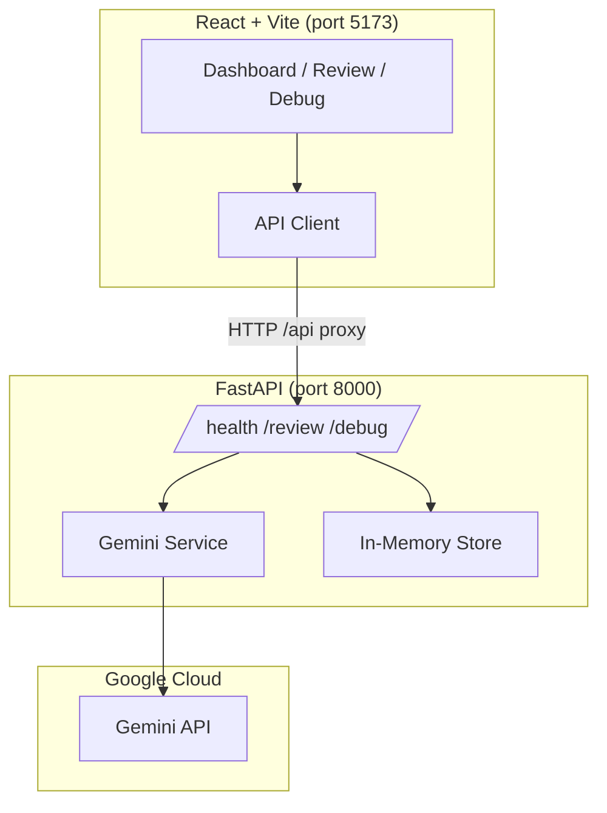
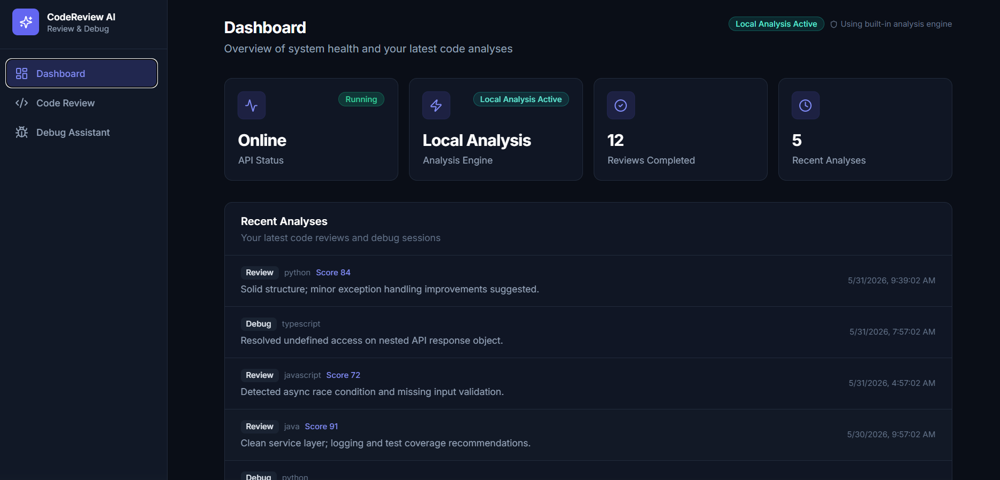
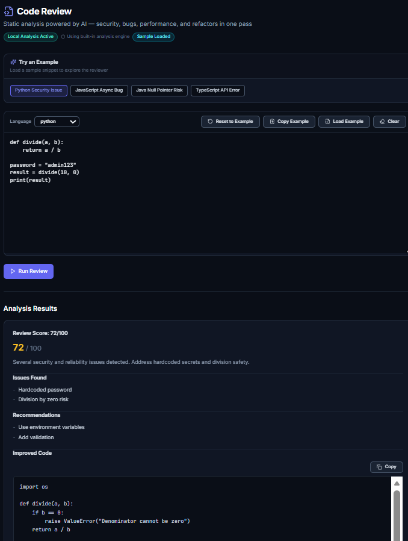
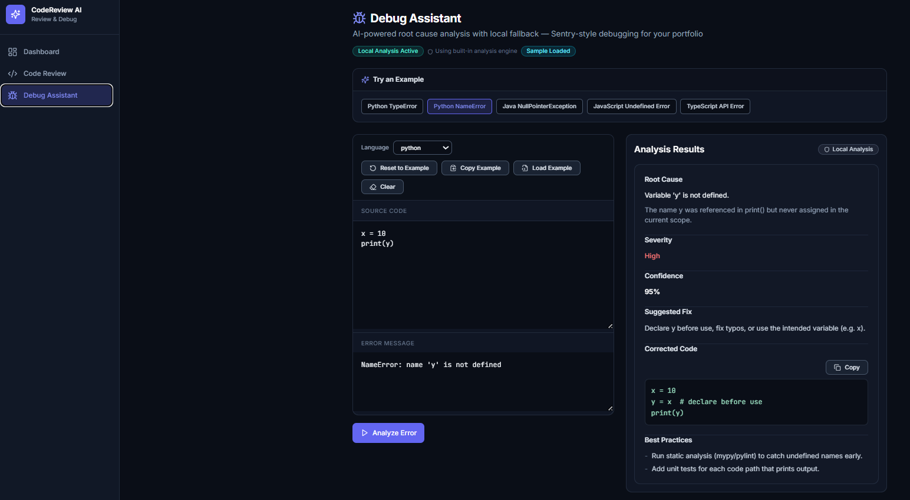
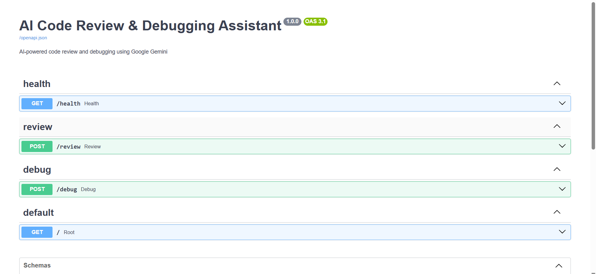

# AI Code Review & Debugging Assistant

A full-stack SaaS-style application that uses **Google Gemini** to analyze source code for bugs, security issues, performance problems, and best practices — plus an AI-powered debugging assistant for error messages.

## Project Summary

Paste code into a modern dark-mode UI and receive structured AI feedback: quality scores, categorized issues, refactored code, and debug fixes. Built with **FastAPI** (Python) and **React + TypeScript + Vite + Tailwind CSS**.

## Features

- **Code Review** — Bug detection, code smells, security warnings, performance tips, best practices, refactored code, and a 0–100 quality score
- **Debug Assistant** — Root cause analysis, explanations, fix recommendations, and corrected code from stack traces
- **Dashboard** — API status, Gemini connection status, review count, and recent analyses
- **Local analysis mode** — When Gemini is unavailable, the app automatically uses a built-in local analysis engine (no error popups)

## Architecture



## Tech Stack

| Layer    | Technologies                                      |
|----------|---------------------------------------------------|
| Backend  | Python, FastAPI, Pydantic, Uvicorn, Google Gemini |
| Frontend | React, TypeScript, Vite, Tailwind CSS             |
| DevOps   | Docker Compose (optional)                         |

## Installation

### Prerequisites

- Python 3.11+
- Node.js 18+
- [Google AI Studio](https://aistudio.google.com/apikey) API key (optional for UI; required for live AI)

### Backend

```bash
cd backend
python -m venv .venv

# Windows
.venv\Scripts\activate

# macOS/Linux
source .venv/bin/activate

pip install -r requirements.txt
copy .env.example .env   # Windows
# cp .env.example .env   # macOS/Linux

# Edit .env and set GEMINI_API_KEY=your_key

uvicorn app.main:app --reload
```

API: http://localhost:8000  
Docs: http://localhost:8000/docs

### Frontend

```bash
cd frontend
npm install
npm run dev
```

App: http://localhost:5173

The Vite dev server proxies `/api` to `http://localhost:8000`.

### Docker (optional)

```bash
# Set GEMINI_API_KEY in environment or .env at project root
docker-compose up --build
```

## API Documentation

See [docs/API.md](docs/API.md) for endpoint details.

| Method | Endpoint  | Description        |
|--------|-----------|--------------------|
| GET    | `/health` | Health & stats     |
| POST   | `/review` | Code review        |
| POST   | `/debug`  | Debug assistant    |

## Screenshots

Screenshots of the application dashboard, code review engine, debug assistant, and Swagger API documentation are shown below.

### Dashboard

Overview with API status, analysis engine, review metrics, and recent activity. **Local Analysis Active** appears when Gemini is unavailable.



### Code Review Results

Sample security review with score, issues, recommendations, and improved code.



### Debug Assistant Results

Split-view debugging with root cause, severity, confidence, and corrected code.



### Swagger API Docs

Interactive OpenAPI documentation at `http://localhost:8000/docs`.



**Capture your own screenshots:**

| File | URL |
|------|-----|
| `dashboard.png` | http://localhost:5173/ |
| `code-review-results.png` | http://localhost:5173/review |
| `debug-assistant-results.png` | http://localhost:5173/debug |
| `swagger-api-docs.png` | http://localhost:8000/docs |

## Environment Variables

| Variable         | Description                    | Default              |
|------------------|--------------------------------|----------------------|
| `GEMINI_API_KEY` | Google Gemini API key          | (required for AI)    |
| `GEMINI_MODEL`   | Model name                     | `gemini-2.0-flash`   |
| `CORS_ORIGINS`   | Allowed frontend origins       | `localhost:5173`     |
| `VITE_API_URL`   | Frontend API base (production) | `/api` (dev proxy)   |

## Future Improvements

- User authentication and saved review history (database)
- GitHub/GitLab PR integration
- Multi-file and repository analysis
- Custom review rule sets and team policies
- Streaming responses for long analyses
- Export reports (PDF/Markdown)
- Support for additional LLM providers

## License

MIT
